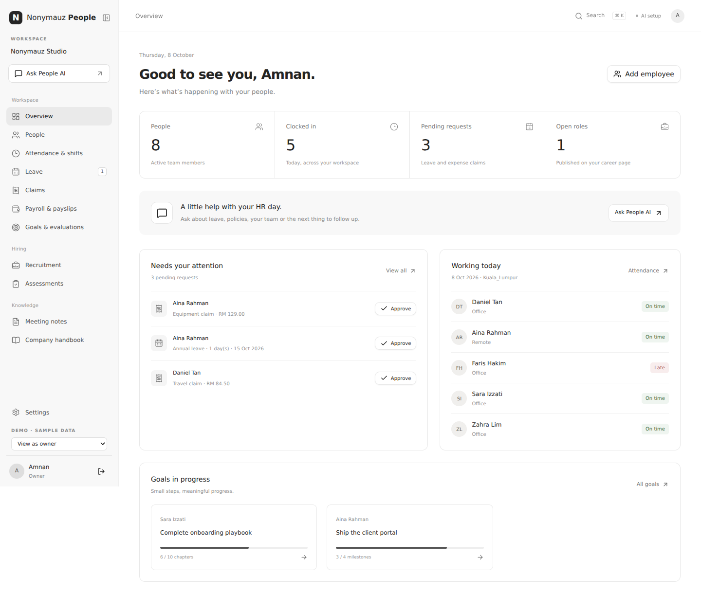

# Nonymauz People

A focused HR workspace inspired by the Kuasa HIRA feature categories, using **ai-nonymauz-cloud** for AI. Built in the existing HRMS repository with Next.js, TypeScript, PostgreSQL, and shadcn/ui. The interface uses a quiet, ChatGPT-style sidebar, neutral colours, and a dedicated chat view.



## Start locally

Requires Node.js 22 or newer.

```bash
npm ci
cp .env.example .env.local
npm run dev
```

On Windows PowerShell, use `Copy-Item .env.example .env.local` instead of `cp`.

Open **http://localhost:3000**. Create a company account, or choose **Explore the demo workspace**. The demo includes fabricated records and owner, HR, manager, and employee views. It is available only when `DEMO_MODE=true` during local development; production and Vercel always reject demo login.

Local development uses PostgreSQL-compatible **PGlite** persisted in `.data/hrms` when `DATABASE_URL` is unset. Restarting the app retains your local records. Production requires a real PostgreSQL `DATABASE_URL`; it never silently switches to ephemeral disk storage.

## Features

| HIRA category              | Implemented behaviour                                                                                                                                                                           |
| -------------------------- | ----------------------------------------------------------------------------------------------------------------------------------------------------------------------------------------------- |
| Employees                  | Profiles, departments, reporting manager, employment status, salary and leave allowances; employee archive revokes linked access.                                                               |
| Companies / departments    | Isolated company workspaces, membership-based switching, department directory.                                                                                                                  |
| Attendance / shifts        | Server-timed clock-in/out, location, recurring and overnight shifts, grace period, daily attendance and worked hours.                                                                           |
| Leave                      | Working-day calculation, company holidays, reserved pending balances, overlap checks, manager/HR review and cancellation.                                                                       |
| Claims                     | Receipts, submission, review notes, approval and a separate mark-as-paid action.                                                                                                                |
| Payroll / payslips         | Monthly draft generation, editable earnings and employee/employer deductions, mandatory review, immutable published snapshots, printable payslips and CSV.                                      |
| EA / CP22 / CP22A          | Downloadable **preparation worksheets**. EA aggregates published annual payroll; CP22 lists starts; CP22A lists archived employees with end dates. These are not official forms or submissions. |
| KPI / goals / evaluations  | Measurable targets, employee progress updates, due dates, manager feedback and ratings.                                                                                                         |
| Meeting notes              | Notes/transcript import, summaries, named action items and completion tracking.                                                                                                                 |
| AI HR assistant            | Permission-filtered company context, record sources, private conversation history and Malay/English responses.                                                                                  |
| Job listings               | Draft / published / closed roles; published listings populate the public career portal.                                                                                                         |
| Candidates                 | Applications, private resumes, notes and a manually managed hiring pipeline.                                                                                                                    |
| Skills / preference tests  | Editable multiple-choice tests; one-use, expiring candidate links; answer keys stay on the server; invitations keep a snapshot of the original test.                                            |
| Career portal              | Public company page, applications with text or PDF/DOCX/TXT resume and explicit recruitment consent.                                                                                            |
| AI recruit assistant       | Job description and interview planning support using the company’s available job listings.                                                                                                      |
| AI resume review           | Evidence-based skill scoring and gaps against a selected job’s requirements, plus interview questions; recruiters decide stages and hiring.                                                     |
| AI work-preference summary | Summarises candidates’ voluntary questionnaire answers; no inferred personality from a resume or validated personality diagnosis.                                                               |

Company handbook, audit trail, account invitations, private attachments, CSV exports and mobile layouts are included.

## Connect ai-nonymauz-cloud

Set these **server-only** variables in `.env.local` or your hosting environment:

```dotenv
AI_NONYMAUZ_BASE_URL=https://your-current-backend/v1
AI_NONYMAUZ_API_KEY=your-backend-bearer-key
AI_NONYMAUZ_MODEL=your-model-alias
```

Use an alias actually returned by your backend’s `GET /v1/models`. The example alias `ai-nonymauz-fast` is configurable. Use the current deployed origin; this repository does not assume the old Render URL is still the correct deployment.

The adapter calls `/v1/chat/completions` through the AI SDK’s OpenAI-compatible provider and sends `Authorization: Bearer ...`. It explicitly supplies `use_rag=false` and `use_tools=false` so company questions use the supplied HR records rather than the backend’s general knowledge or web tools. It has a bounded timeout and does not retry a paid generation automatically.

The company owner must turn on **Settings → AI connection → Enable AI** before records are sent. API keys are never stored in browser variables. Record contents and transcripts are treated as untrusted input; there are no model-controlled write tools. Replies show the records supplied, which may be a limited context snapshot. Responses require human review.

Recruitment consent includes the configured AI review. The server removes known candidate name, email and phone values before sending a resume for review, but free-text resumes may contain other personal information. Your ai-nonymauz-cloud model provider configuration still determines how upstream providers handle submitted data.

## Access model

| Role     | Access                                                                                                            |
| -------- | ----------------------------------------------------------------------------------------------------------------- |
| Owner    | HR workflows, company settings, AI opt-in, account invitations and access removal.                                |
| HR       | Employee management, company HR workflows, payroll, hiring, meeting notes and handbook.                           |
| Manager  | Their direct team’s attendance, leave, claims and goals; approval of team requests; their own published payslips. |
| Employee | Own requests, attendance, goals and published payslips, plus a redacted directory and handbook.                   |

An employee/manager account must be linked to an employee profile with the same email. Owners can link accounts in Settings. Invitations are copied and shared manually; the app does not send emails or messages. Request creators cannot approve their own requests, including an owner identified by their employee email. Public application and assessment routes expose only their intended public fields.

## Production configuration

1. Provision PostgreSQL and set `DATABASE_URL` using its serverless/pool connection string where applicable.
2. Set `APP_URL` to the exact application origin, such as `https://hr.example.com`. Mutations validate their Origin header; configure the correct origin for each preview environment too.
3. Set the three AI variables above and `DEMO_MODE=false`.
4. Run `npm run db:migrate`, then `npm run build` and `npm start`, or connect the repository to your Next.js host.
5. Create the owner account, add employee profiles, and generate invitations from Settings.

The schema is idempotent and also initialises on first database use. PostgreSQL migration and workflow transactions use locks. Sessions are opaque, hashed in the database and placed in HttpOnly cookies; production uses Secure cookies. Passwords use Node’s scrypt with per-password salts. Queries are parameterised and company-scoped. Origin checks, database-backed rate limits, attachment access checks and optimistic edits are enforced server-side.

Uploads are stored privately in PostgreSQL with a default **2 MB per file** and **100 MB per company** quota. PDF/DOCX/TXT extraction supplies resume and transcript text; scanned PDFs need pasted text because OCR is not included. Receipt images are stored for reviewers, without automatic OCR. Meeting audio recording/transcription is not included. These limits can be configured through the documented environment variables, although the upload endpoint deliberately caps each request at approximately 2 MB.

Payroll deductions and any salary proration must be calculated and verified by HR. Draft amounts are not a Malaysian statutory calculation engine. EA worksheets summarise the available published payroll amounts, not every EA classification or benefit-in-kind field. Complete the current official employer form and submit through [MyTax](https://mytax.hasil.gov.my/) following [HASiL employer guidance](https://www.hasil.gov.my/majikan/tanggungjawab-majikan/).

The current workspace screen loads the latest 2,000 records and explicitly reports truncation. CSV exports query all applicable records. Add server pagination and a scalable file store before using this initial workspace at a substantially larger scale. This initial release has no SSO, email delivery, password-reset mail, bank transfers, or statutory e-filing integration.

## Verification

```bash
npm test
npm run typecheck
npm run lint
npm run build
npx playwright install --with-deps chromium
npm run verify:ui
```

The database integration suite verifies isolation, invitations, approvals, attendance, payroll, assessment snapshots, file authorisation, CSV escaping and the ai-nonymauz-cloud request contract. AI tests mock the upstream endpoint; a live AI smoke test requires your actual credentials and model availability.

The browser runner starts an isolated local server with fabricated records, exercises desktop and mobile workflows, and checks public applications, assessments, payroll publication and employee isolation. It uses Playwright Chromium; install it with the command above, or set `CHROMIUM_PATH` to an installed compatible browser. Test data is temporary and removed after the run.

## Project layout

- `src/app` — pages and authenticated/public API routes.
- `src/components` — HR screens and official-source shadcn/ui primitives.
- `src/lib` — database, validation, permissions, workflows and AI adapter.
- `tests` — database integration tests.
- `scripts` — schema migration and browser verification.
- `docs` — implementation notes and screenshots.

Third-party shadcn/ui component source is distributed under its MIT licence; see `THIRD_PARTY_NOTICES.md`.
